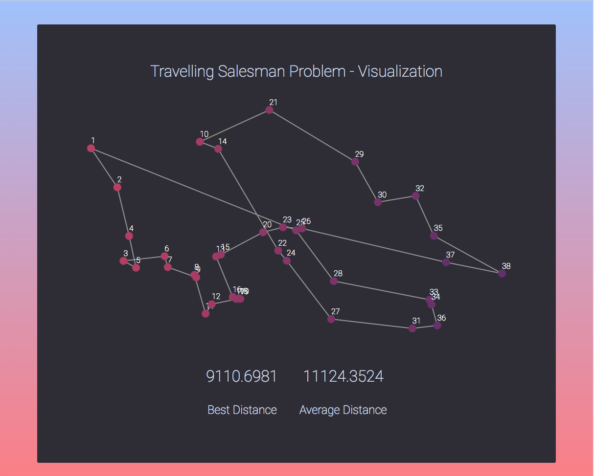

# TSP - GA

[](https://travis-ci.com/fzxt/tsp-ga)
[](https://codeclimate.com/repos/5a85e6d589f16108470002ad/test_coverage)
[](https://codeclimate.com/repos/5a85e6d589f16108470002ad/maintainability)



> Travelling salesman problem solved via genetic algorithm, [Demo](https://fzxt.github.io/tsp-ga/)

## Dev
```
npm install
npm run dev
```

Then navigate to `http://localhost:8080`, server run by webpack-dev-server

## Build
`npm run build`

Will generate a `bundle.js` file in the `out` directory.

## Run tests
`npm test`